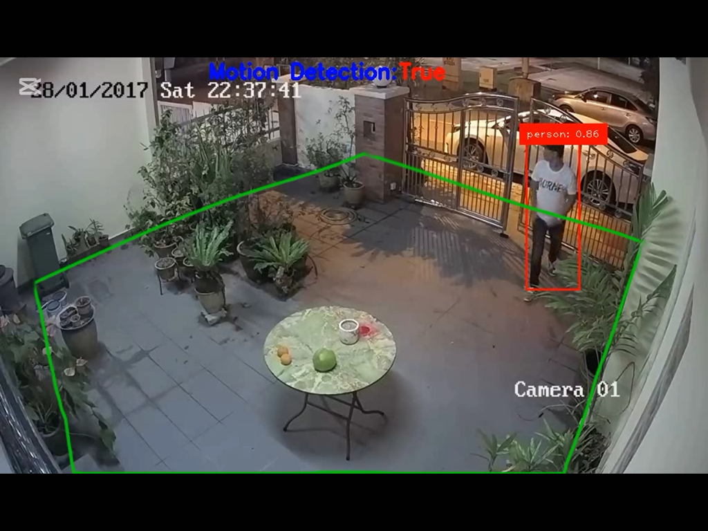

# 🕵️‍♂️ Intrusion Detection System Using YOLOv11 & OpenCV

## 📖 Project Overview
This project implements a **real-time person detection and motion alert system** using the YOLOv11 model and OpenCV in Python. It processes video input, detects persons in frames, tracks their motion, and triggers an alarm when motion is detected within a user-defined polygonal area.

---

## 📂 Project Structure

```
.
├── Model/                      # YOLOv11 model weights
│   └── yolo11m.pt
├── Results/                    # Sample output videos
│   ├── Result 1.mp4
│   └── Result 2.mp4
├── Testing Resources/          # Input test videos
│   ├── video1.mp4
│   └── video4.mp4
├── main_code_file.py           # Main Python script for detection and tracking
├── alarm.mp3                   # Alarm sound file
├── must watch (how to draw a polygon).mp4  # Tutorial video on drawing polygon
├── Instuctions.pdf             # Additional instructions (PDF)
├── requirements.txt           # Python dependencies
└── README.md                  # This file
```

---

## ⚙️ Installation

1. **Clone the repository:**

```bash
git clone <repository-url>
cd <repository-directory>
```

2. **Create and activate a virtual environment (recommended):**

```bash
python -m venv venv
# Windows
venv\Scripts\activate
# macOS/Linux
source venv/bin/activate
```

3. **Install dependencies:**

```bash
pip install -r requirements.txt
```

---

## 🚀 How to Run

1. Ensure the YOLO model file `yolo11m.pt` is in the `Model/` directory.

2. Place your test video(s) inside the `Testing Resources/` folder.

3. Run the main detection script:

```bash
python main_code_file.py
```

4. A window will open showing the video feed.

5. **Define the polygonal area** for motion detection by clicking points on the video window. The polygon will be drawn as you click.

6. When a person moves inside the polygon, an alarm sound will play and the system will display "Motion Detected".

7. Press **`q`** to quit the program.

---

## 🎥 How to Draw the Polygon

Watch the tutorial video **"must watch (how to draw a polygon).mp4"** included in the project for detailed instructions on defining the polygonal detection area.

---

## 📊 Results

Sample output videos demonstrating the detection and alert system are available in the `Results/` folder:

- `Result 1.mp4`
- `Result 2.mp4`

---

## 🛠️ How It Works

- Loads the YOLOv11 model (`yolo11m.pt`) for person detection.
- Processes video frames from input videos.
- Tracks detected persons and their motion across frames.
- Allows user to define a polygonal region of interest.
- Plays an alarm sound when motion is detected inside the polygon.
- Displays bounding boxes and confidence scores on detected persons.

---

## 📦 Requirements

- Python 3.x
- `opencv-python`
- `numpy`
- `ultralytics`
- `cvzone`
- `playsound`
- `matplotlib`

Install all dependencies using:

```bash
pip install -r requirements.txt
```

---

## ⚠️ Notes

- Ensure `alarm.mp3` is present in the project root for the alarm sound.
- Adjust video input path in `main_code_file.py` if using different videos.
- The polygon must have at least 3 points to be valid.
- The system processes every 3rd frame for performance optimization.

---

## 📄 License

This project is licensed under the MIT License. See the LICENSE file for details.

---
Project by: Mudassar Khan
Made with ❤️ using YOLOv11 and OpenCV.
